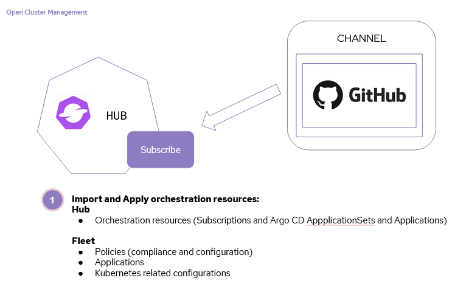

# gitops-fleet-samples
This is a sample repository layout for fleet management via GitOps

## Purpose
This repository is a sample layout for managing a fleet of clusters from a centralized hub.  The layout contains examples related to Configurations, 
Policies and Applications.

## Requirements
* Open Cluster Management for Kubernetes
* OpenShift GitOps (Argo CD)
* Fork of the repository
* Clusters (for import) or Cloud Provider (for provisioning) or *ks (for import)
* Subscription Admin role. (Connect to your hub and run the `./makeAppSubAdmin` script

## What makes it work
The key is identifying clusters for delivery of resources. In Kubernetes resources are Configuration, Policy compliance, and Applications.  This is 
obtained using `labels` to group and match resources to managed clusters.  When delivering resources in GitOps, this is done from Git repositories 
to clusters in your fleet. The open cluster management community refers to this as subscribing your cluster to a source. This can be accomplished with 
`subscription.apps.open-cluster-management.io` or `applications.argoproj.io` & `applicationsets.argoproj.io`, these both work similarly and you can move
back and forth between the two. Utilizing resources in Git is not vendor specific, so any Git resource delivery system can be leveraged.

## Step 1, subscribe your orchestration resources
This is the backbone of fleet management, it instantiates the orchestration resources needed to manage the fleet.  In this sample, this is made up 
of Open Cluster Management configuration policies, Open Cluster Management security policies and Applications (via Subscriptions and Argo CD ApplicationSets)



### Get started
* First make sure you as a Subscription-Admin. This can be done by connetion to the ACM Hub via the `oc` cli, and then running the `./makeAppSubAdmin` script (no additional parameters required).
* On the hub cluster subscribe this repositories `./seeds` folder. This will start to apply Configuration, Security Policies and Applications.
(You can use a Subscription or Argo CD Application for this)
* Once the Subscriptions, ApplicationSets and Policies are applied to the hub if you already have clusters available, they may start to be configured and prepared,
otherwise start labeling them as described in the next step.

## Step 2, label your infrastructure
* Labels on your Open Cluster Management ManagedCluster or Argo CD cluster secrets, help drive placement.  For Open Cluster Management, this allows placement
decisions for subscriptions and policies.  Labels on your cluster secrets in Argo CD will be leveraged by ApplicationSets.
```yaml
# Supported labels for ManagedCluster or Argocd Secrets
usage: production
# and
usage: development
```

## Step 3, expand the fleet
* Once you've decided on a labelling strategy (labels that are leveraged by placement), as you import or provision new managed clusters, your configurations, 
security policies and applications will be applied
